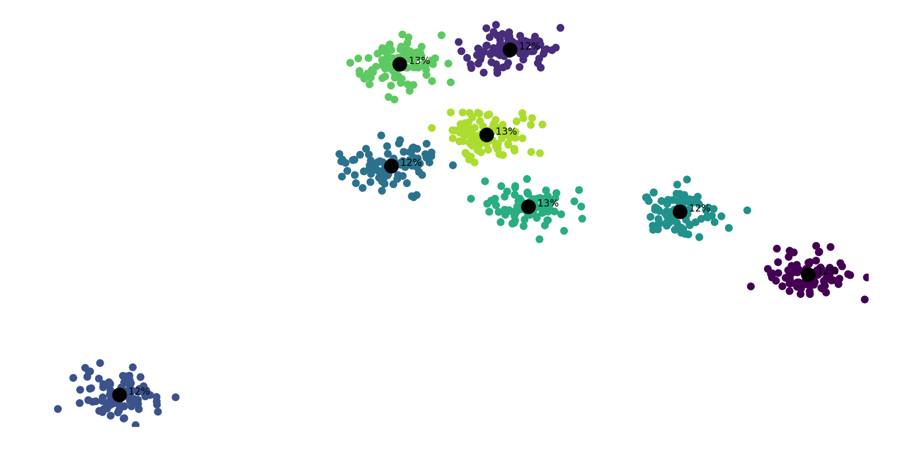

# MediaPipe Voter

## Description

Проект, реализующий систему голосования при помощи библиотеки MediaPipe (распознавания выбранного варианта как положения кончика указательного пальца), а также обработки и отрисовки кластеров на стороне сервера.

## Installation

1. Склонировать репозиторий в локальную папку:

   ```bash
   git clone https://github.com/kgleba/mediapipe-voter
   cd mediapipe-voter
   ```

2. Установить зависимости:

   ```bash
   pip install -r requirements.txt
   ```

3. Проверить работоспособность функционала проекта:

   ```bash
   python test_clustering.py
   ```

   или 

   ```bash 
   python -m unittest test_clustering
   ```

## Usage

**Запуск сервера:** 

```bash 
python server.py [-h] [-n N_CLUSTERS] port
```

`-n`, или `--n-clusters` позволяет уточнить количество кластеров, если оно известно (в противном случае будет определено автоматически)

`port` определяет, на каком порту будет запущен сервер

После запуска отобразится окно, в котором будут отображаться кластеризованные (и подписанные процентными долями) точки, полученные от клиентов:



**Note:** на данный момент вместо взаимодействия клиент-сервер применяется симуляция, генерирующая точки

**Запуск клиента:**

```bash
python client.py [-h] [--live] host port
```

Параметры `host` и `port` определяют, к какому серверу будет подключаться клиент

Параметр `--live` работает как переключатель (наличие/отсутствие), и отображает окно, в котором выводится изображение с камеры и отмеченным указательным пальцем, который учитывается в данный момент

Затем в автоматизированном режиме координаты указанной точки передаются на заданный сервер

## Status

In development